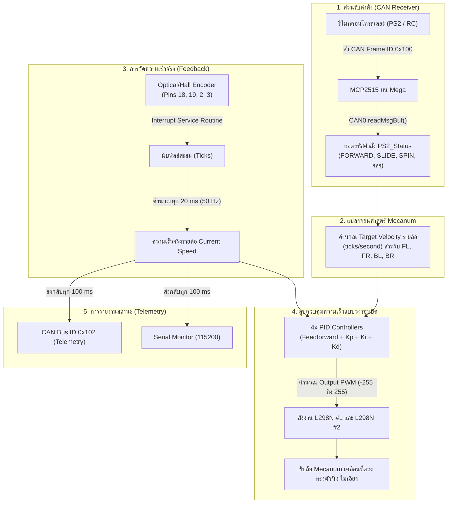

# 🚜 สรุปการทำงานและการต่อวงจร: Mecanum Motor Controller (Arduino Mega 2560)

เอกสารสรุปการปรับปรุงโค้ดและผังการต่อสายของระบบควบคุมมอเตอร์ขับเคลื่อนล้อแม็กคาน็อม (Mecanum Wheel Controller) ทำงานร่วมกับ **Quadrature Encoder 4 ล้อ**, **Closed-Loop PID Control**, **การสื่อสารผ่าน CAN Bus (MCP2515)** และตัดส่วนควบคุม Servo/แขนกล ออกทั้งหมด

---

## 1. ผังการต่อสายฉบับใช้งานจริง (Pinout Mapping)

อ้างอิงตามผังใน `firmware/pinout/` สำหรับบอร์ด **Arduino Mega 2560**

### 1.1 Quadrature Encoders (4 ล้อ)
| มอเตอร์ | ขาสัญญาณส้ม (OA) | ขาสัญญาณเขียว (OB) | ขาเหลือง (VCC) | ขาขาว (GND) | หมายเหตุ |
| :--- | :---: | :---: | :---: | :---: | :--- |
| **M1 หน้าซ้าย (FL)** | **Pin 18** | **Pin 26** | 5V | GND | OA ต่อ Hardware INT3 |
| **M2 หน้าขวา (FR)** | **Pin 19** | **Pin 27** | 5V | GND | OA ต่อ Hardware INT2 |
| **M3 หลังซ้าย (BL)** | **Pin 2** | **Pin 28** | 5V | GND | OA ต่อ Hardware INT0 |
| **M4 หลังขวา (BR)** | **Pin 3** | **Pin 29** | 5V | GND | OA ต่อ Hardware INT1 |

> [!IMPORTANT]
> ขาส้ม (OA) ทั้ง 4 ตัว ต่อเข้ากับขา **Hardware External Interrupt** ของ Arduino Mega เพื่อให้นับพัลส์ได้ทันและไม่ตกหล่นแม้ล้อหมุนด้วยความเร็วสูง

---

### 1.2 L298N #1 (ขับล้อหน้า M1, M2)
| ขาโมดูล L298N #1 | ขา Arduino Mega | หน้าที่ |
| :--- | :---: | :--- |
| **ENA** | **Pin 5 (PWM)** | ปรับความเร็วล้อหน้าซ้าย (M1) |
| **IN1** | **Pin 22** | กำหนดทิศทาง 1 (M1) |
| **IN2** | **Pin 23** | กำหนดทิศทาง 2 (M1) |
| **IN3** | **Pin 24** | กำหนดทิศทาง 1 (M2) |
| **IN4** | **Pin 25** | กำหนดทิศทาง 2 (M2) |
| **ENB** | **Pin 6 (PWM)** | ปรับความเร็วล้อหน้าขวา (M2) |

---

### 1.3 L298N #2 (ขับล้อหลัง M3, M4)
| ขาโมดูล L298N #2 | ขา Arduino Mega | หน้าที่ |
| :--- | :---: | :--- |
| **ENA** | **Pin 7 (PWM)** | ปรับความเร็วล้อหลังซ้าย (M3) |
| **IN1** | **Pin 30** | กำหนดทิศทาง 1 (M3) |
| **IN2** | **Pin 31** | กำหนดทิศทาง 2 (M3) |
| **IN3** | **Pin 32** | กำหนดทิศทาง 1 (M4) |
| **IN4** | **Pin 33** | กำหนดทิศทาง 2 (M4) |
| **ENB** | **Pin 8 (PWM)** | ปรับความเร็วล้อหลังขวา (M4) |

---

### 1.4 MCP2515 CAN Bus Module (SPI บน Mega)
| ขาโมดูล MCP2515 | ขา Arduino Mega | รายละเอียด |
| :--- | :---: | :--- |
| **CS** | **Pin 10** | Chip Select |
| **SO (MISO)** | **Pin 50** | Master In Slave Out |
| **SI (MOSI)** | **Pin 51** | Master Out Slave In |
| **SCK** | **Pin 52** | SPI Clock |
| **VCC / GND** | **5V / GND** | ไฟเลี้ยงโมดูล |

> [!NOTE]
> ระบบตรวจจับแพ็กเก็ต CAN ผ่าน SPI Register Polling (`CAN0.checkReceive() == CAN_MSGAVAIL`) ทำให้**ไม่ต้องใช้ขา Interrupt (Pin 2)** ซึ่งถูกนำไปใช้งานกับ Encoder ล้อ M3 แล้ว

---

## 2. ลำดับการทำงานและการประมวลผล (System Flowchart)



---

## 3. หลักการควบคุมความเร็ว (Closed-Loop PID Control)

ล้อแม็กคาน็อม (Mecanum Wheels) อาศัยแรงเสียดทานและเวกเตอร์ความเร็วของล้อทั้ง 4 เพื่อกำหนดทิศทาง หากมอเตอร์ตัวใดตัวหนึ่งมีความเร็วไม่เท่าเพื่อน จะทำให้หุ่นยนต์วิ่งเอียงหรือสไลด์ไม่ตรง ระบบนี้จึงใช้ **Closed-Loop PID ควบคุมความเร็วรอบของล้อแต่ละข้างแยกอิสระ**:

1. **Feedforward Base:** จ่ายค่า `MOTOR_BASE_PWM` ทันทีเมื่อมีเป้าหมาย เพื่อให้ออกตัวฉับไว ไม่มีอาการหน่วงรอสะสม Error
2. **PID Correction:** ปรับชดเชย PWM รายล้อตามผลต่างระหว่าง Target Speed กับความเร็วจาก Encoder จริง
3. **Anti-Windup:** ป้องกันค่าสะสม Integral ล้นเกิน (`constrain integral`) เพื่อไม่ให้มอเตอร์ค้างเวลาเปลี่ยนทิศทาง
4. **Fail-Safe Watchdog:** หากสัญญาณ CAN ขาดหายเกิน `300 ms` ระบบจะตัดการจ่ายไฟเข้ามอเตอร์ทันที (`motor_stop()`) เพื่อความปลอดภัย

---

## 4. โครงสร้างไฟล์ในโมดูล `firmware/motor_controller/`

```
firmware/motor_controller/
├── robot_config.h        # การตั้งค่าพินมอเตอร์, พิน Encoder, ค่า Gain PID, และความเร็ว
├── encoder.h             # เฮดเดอร์ฟังก์ชันตัวนับพัลส์และคำนวณความเร็ว Encoder
├── encoder.cpp           # การตั้งค่า Interrupts (Pins 18, 19, 2, 3) และคำนวณ ticks/sec
├── motor.h               # เฮดเดอร์ฟังก์ชันการเคลื่อนที่ Mecanum และ PID
├── motor.cpp             # จลนศาสตร์ล้อแม็กคาน็อม 10 ทิศทาง และลูป PID 4 ล้อ
├── motor_controller.ino  # สเก็ตช์หลัก: จัดการ CAN Bus, ลูป 50Hz, Fail-safe, และ Telemetry
└── README.md             # เอกสารสรุปการทำงานและการต่อวงจร (ไฟล์นี้)
```

---

## 5. การทดสอบและการส่งข้อมูล (Telemetry)

ทุกๆ `100 ms` ระบบจะส่งข้อมูลสถานะและค่า Encoder ออกทาง:
1. **CAN Bus:** แพ็กเก็ต ID `0x102` (`CAN_ID_TELEMETRY`) บรรจุสถานะมอเตอร์ และความเร็วรอบของแต่ละล้อ
2. **Serial Monitor (115200 baud):**
   ```text
   M: 1 | Enc Ticks [FL,FR,BL,BR]: 1250, 1248, 1252, 1249 | Speeds: 802, 799, 804, 800
   ```
